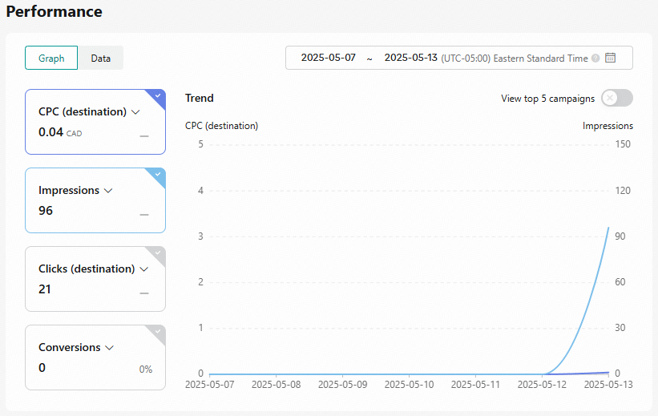

# E-commerce Entrepreneur & Digital Marketing Specialist

## Overview

I launched a Shopify store as a side project, successfully leveraging Google Ads and TikTok Ads to drive traffic and conversions. Developed and designed the website independently, showcasing my proficiency in digital marketing strategies and e-commerce platforms. By creating engaging ad campaigns and optimizing the store, I demonstrated strong analytical, creative, and technical skills. This experience highlights my ability to take initiative, solve complex problems, and deliver tangible results.

## Features

- **Shopify Store Setup**: Custom design and implementation.
- **Google Ads Campaigns**: Traffic and conversion optimization.
- **TikTok Ads Strategy**: Engaging content creation and audience targeting.

## Skills Demonstrated

- **Digital Marketing**: Strategy and execution across multiple platforms.
- **Web Development**: Designing and developing a user-friendly e-commerce interface.
- **Analytics**: Performance tracking and data-driven optimization.

## Screenshots and Media

### Shopify Dashboard

*Description:* Overview of store performance metrics reflecting e-commerce management skills.

### Google Ads Dashboard

*Description:* Displaying the impressions and clicks generated by my Google Ads campaigns, highlighting audience targeting and engagement effectiveness.

### Additional Google Ads Images

Here are some insights from other images that portray varied aspects of my Google Ads strategy:

  
 

### TikTok Ads Dashboard

*Description:* Displaying the impressions and clicks generated by my TikTok campaigns, highlighting audience targeting and engagement effectiveness.

### TikTok Ads Video Content

To view my TikTok Ads strategy and engagement, watch these GIFs:

 
 

## Project Structure

- `/GoogleAds`: Contains images and videos related to Google Ads campaigns.
- `/TikTokAds`: Contains videos related to TikTok Ads strategies.
- `/Shopify`: Contains images of Shopify dashboard performance and insights.

## Learning Outcomes

- Developed deeper insights into user behavior analytics and effective ad strategies through campaign analysis.
- Learned to adapt marketing tactics to optimize ad spend and improve ROI, ensuring efficient budget management.

  ## Connect

- [View My LinkedIn Profile](www.linkedin.com/in/lenny-plante) 
- [Download My CV](https://yourwebsite.com/cv)

## Conclusion

This project showcases my capacity to independently execute and manage an e-commerce site with integrated digital marketing campaigns. For further inquiries or collaboration opportunities, please contact me.
